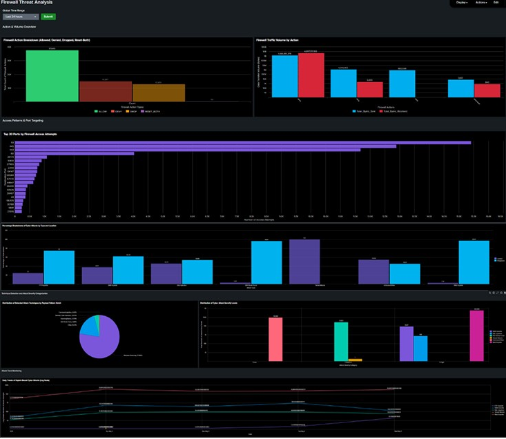

# splunk-soc-log-analysis
Security Operations dashboards built in Splunk for multi-source log analysis (Honeypot, IDS, Firewall, Apache, Linux Auth). Features anomaly detection, geo-mapping, and forecasting.

📄 **Full summary (PDF):** [Joe Coffee SOC Dashboard Portfolio.pdf](pdf/Joe%20Coffee%20SOC%20Dashboard%20Portfolio.pdf)

---

 Dashboard Snapshots

 Firewall Threat Analysis

