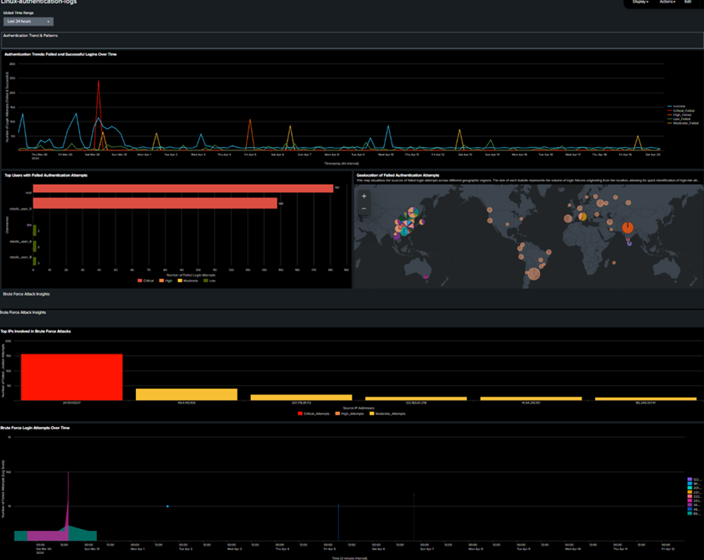

# splunk-soc-log-analysis
Security Operations dashboards built in Splunk for multi-source log analysis (Honeypot, IDS, Firewall, Apache, Linux Auth). Features anomaly detection, geo-mapping, and forecasting.

📄 **Full summary (PDF):** [Joe Coffee SOC Dashboard Portfolio.pdf](pdf/Joe%20Coffee%20SOC%20Dashboard%20Portfolio.pdf)

---

---

 SOC Dashboard Gallery

This gallery presents the five Splunk dashboards I built for a simulated SOC environment.  
Each visual uses **custom SPL queries** to analyse, map, and forecast activity across multiple log sources.

|  Honeypot |  Linux Authentication |
|:--:|:--:|
|  |  |
| *Mapped reconnaissance and botnet attack patterns across London & Singapore honeypots, classified by type and severity.* | *Analysed successful vs failed logins, top users and IPs, and geo-located brute-force attempts worldwide.* |

|  Apache Web Server |  Firewall Threat Analysis |
|:--:|:--:|
|  |  |
| *Tracked access behaviour, response code trends, and geographic distribution of client requests to detect scanning activity.* | *Classified allowed vs denied traffic, analysed high-risk ports, and visualised firewall throughput to identify suspicious patterns.* |

|  IDS Threat Monitoring (TII-SSRC-23) |
|:--:|
|  |
| *Detected attack subtypes, applied spike detection via `streamstats`, and forecasted 24-hour malicious traffic trends with `predict`.* |

---

 Tools & Techniques
- **Platform:** Splunk Enterprise (Standalone)
- **Languages:** SPL (Search Processing Language)
- **Datasets:** Honeypot, IDS, Firewall, Apache, Linux Authentication
- **Features:** Geo-mapping, forecasting, anomaly detection, severity classification, escalation simulation
- **Environment:** Ubuntu VM

📄 Full portfolio summary (PDF): [Joe Coffee SOC Dashboard Portfolio](pdf/Joe%20Coffee%20SOC%20Dashboard%20Portfolio.pdf)
